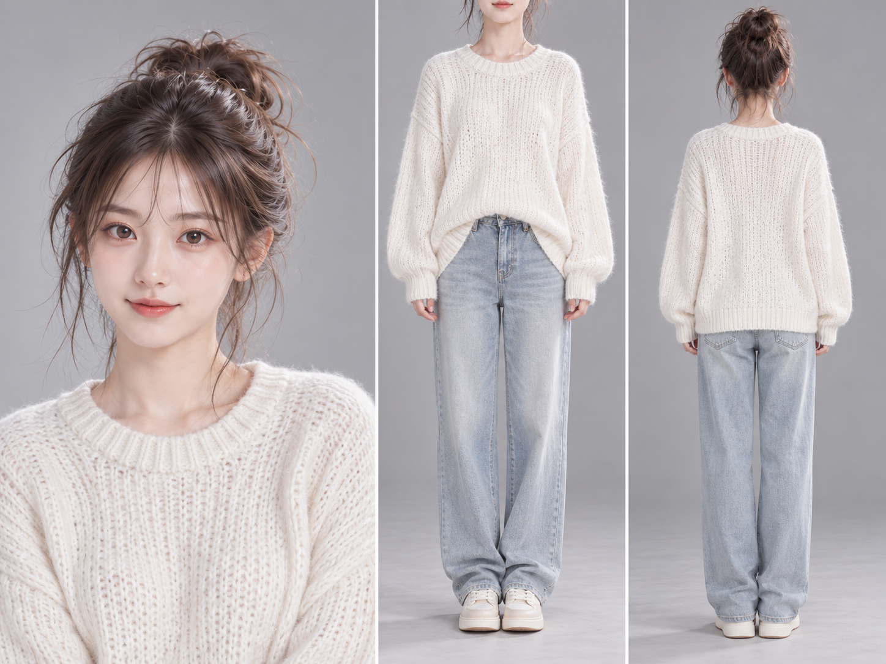
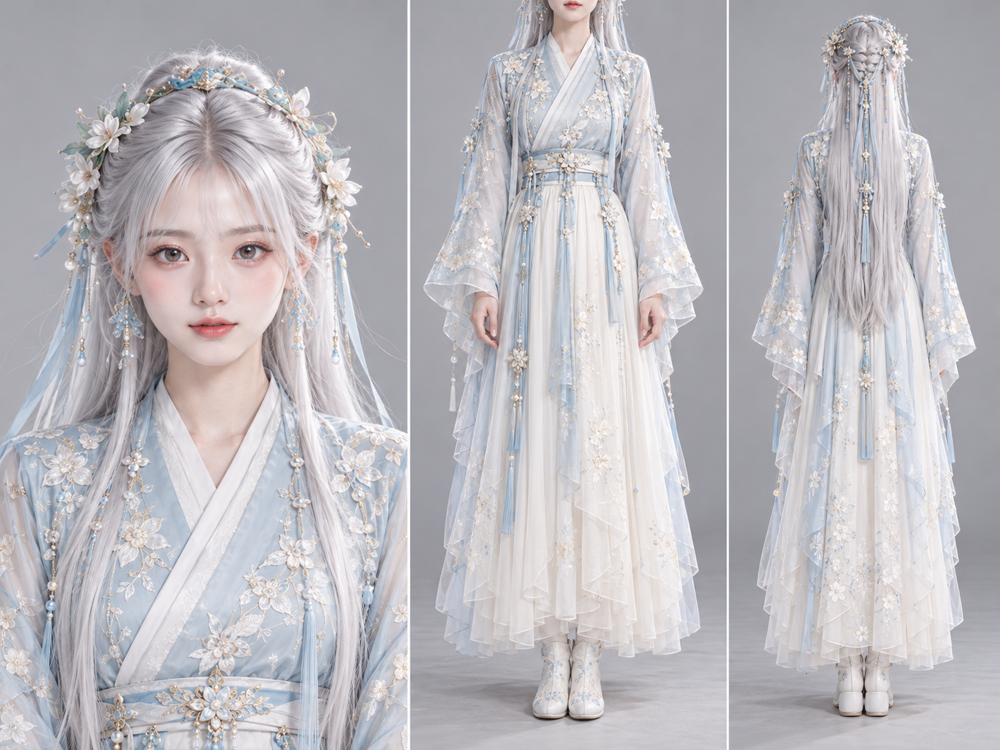
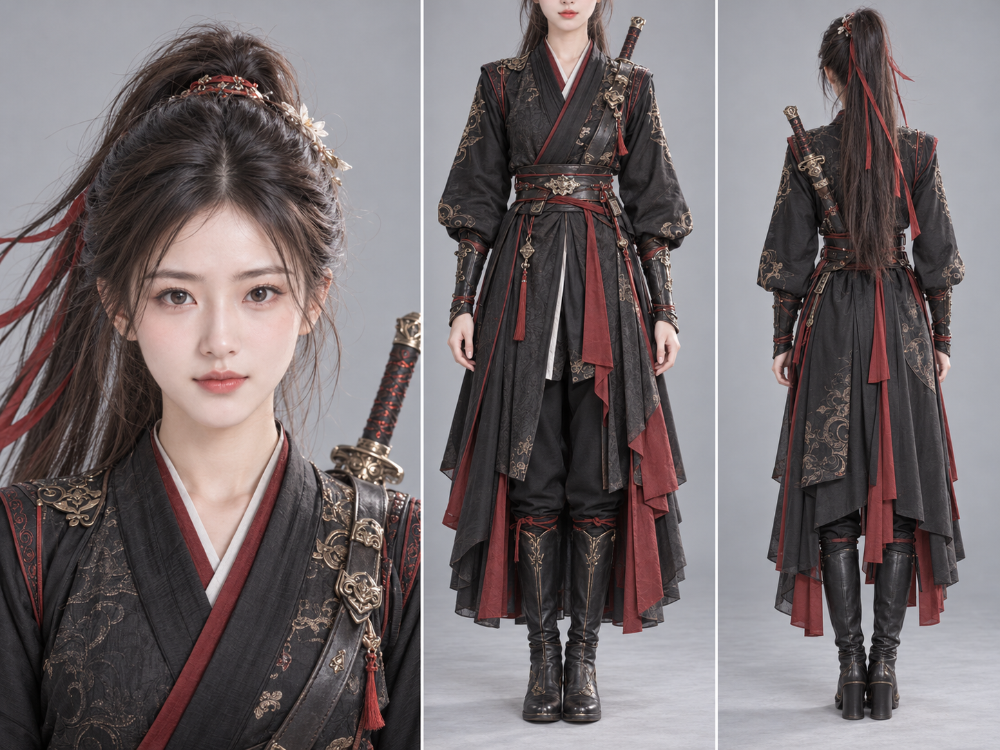
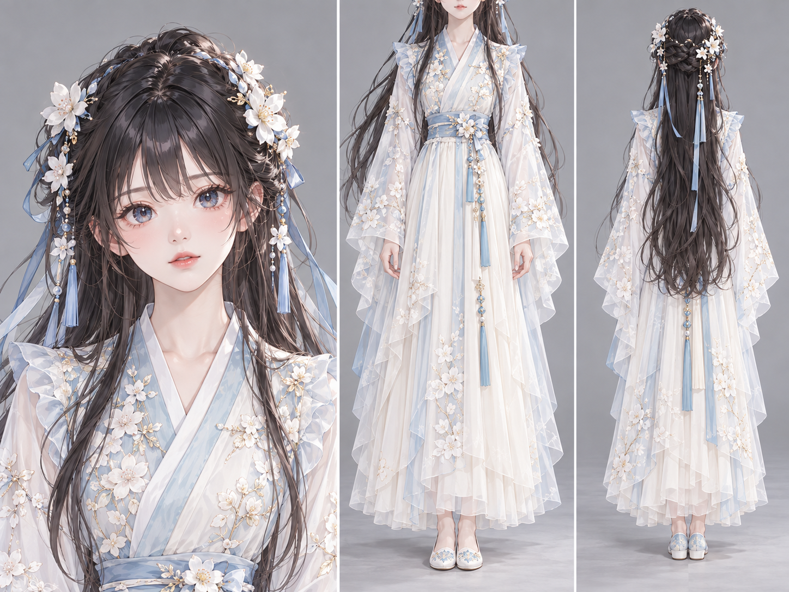
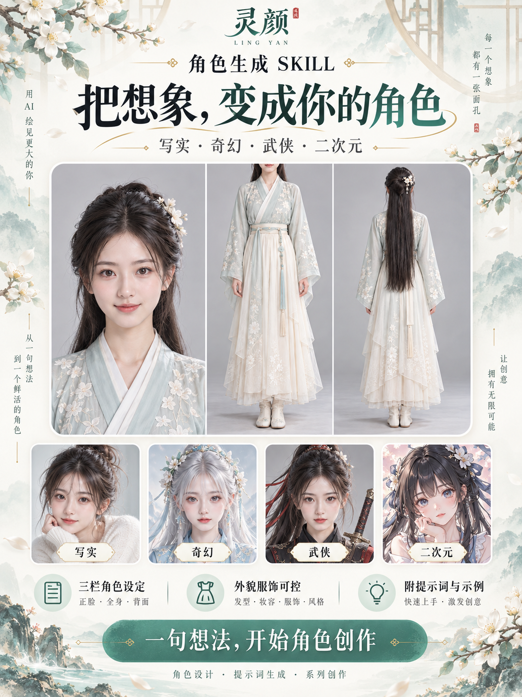

# 小辉 · 角色生成

将人物想法转成角色设定和可执行的中文出图提示词，支持写实、奇幻、武侠、二次元。默认设计18岁成年东方女孩，可根据需求调整性别、年龄、脸型、发型、服饰和气质。

## 默认构图

4:3横向三栏：左侧正面胸像，正脸直视、适当缩小并留白；中间从下半张脸到鞋底的正面身体，上半张脸在画外；右侧完整背面全身。三栏保持同一人物、服饰和发型，使用灰底与细白分隔线。多人物通过外貌与造型区分，不靠转头或歪头制造区别。古装与奇幻默认正常人耳。

## 下载和使用

- [标准技能包](../packages/xiaohui-character-generation-v1.0.0.zip)：解压后将 `xiaohui-character-generation` 文件夹放入所用工具的技能目录。
- [即梦单文件版](../packages/小辉角色生成-即梦上传版.md)：进入即梦网页版 Agent 模式，若账号有“添加技能”入口，上传此 Markdown 文件；也可尝试拖入对话，明确要求按文件执行。入口与持久保存能力以实际账号为准，尚未在即梦登录环境验证。
- [技能源文件](../xiaohui-character-generation/SKILL.md)
- [四类案例提示词](../xiaohui-character-generation/references/examples.md)

示例请求：

> 使用小辉角色生成，做一个18岁成年东方女侠，正脸清秀、正常人耳，浅蓝白衣服。按默认三栏布局直接出图。

> 按参考图保留这个角色的脸、发型和衣服，做正面胸像、正面身体和背面全身三栏图。

宿主支持图像生成时实际出图；没有图像工具时输出提示词。Skill不是独立生图模型，实际效果与身份一致性取决于宿主模型及参考图功能。

## 案例

以下为内置 imagegen 以推广页底部头像为参考生成的三栏案例，不代表即梦实测效果。广告未展示的全身服装由生成模型补全。

| 写实 | 奇幻 |
|---|---|
|  |  |

| 武侠 | 二次元 |
|---|---|
|  |  |

[推广页原图](../examples/character-generation/推广页.png)沿用制作时的“灵颜”视觉名称，正式技能名为“小辉 · 角色生成”。

